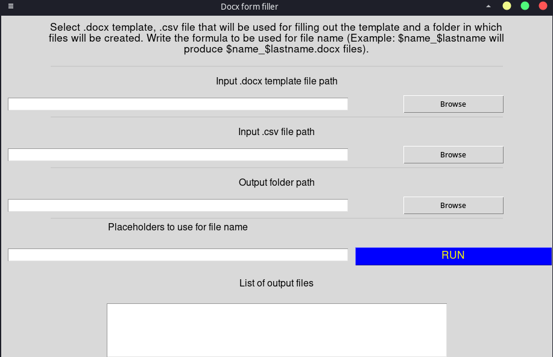
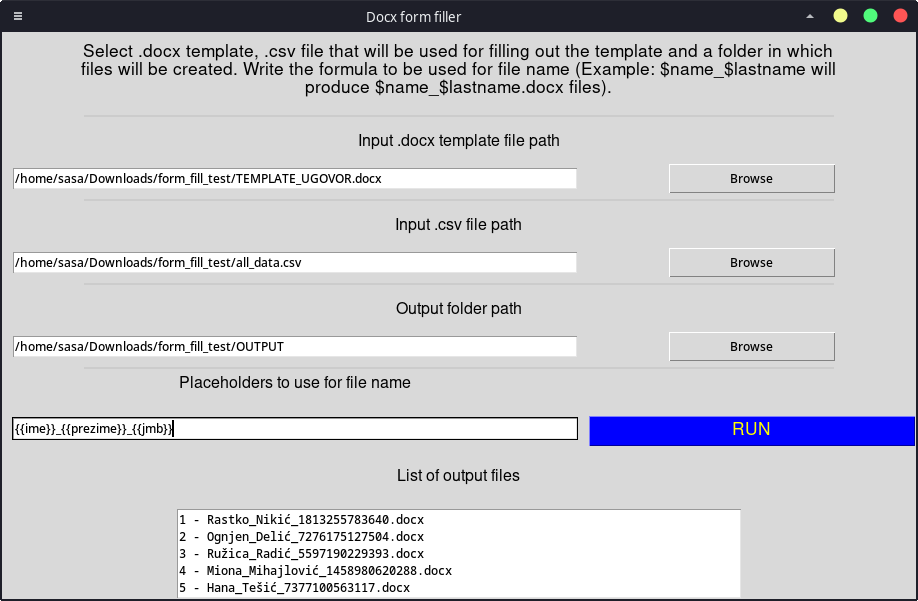

# .docx form filler
What does it do?
It can fill out a `.docx` template file with data from `.csv` file.
Useful if you already have all the data in a table somewhere and need to fill out a lot of forms.

## Requirements
- `python-docx==0.8.11`

## How to use?
You need to provide:
1. `.docx` template file with some placeholders (I used the form {{name}}, or $name in my testing)
2. `.csv` file that is used to fill those placeholders. The names of the columns should be the same as your placeholders and the values in one row will be used to create one file
3. path to the output folder
4. formula to be used for file names (example: `{{name}}_{{last_name}}` will produce `John_Smith.docx` files).

You can run it as a standalone .exe.
Alternatively you can run `gui.py` to get the same functionality or just use it directly from `docx_editor.py`.

## Images

## Issues
1. Sometimes it will freeze if you have a lot of files to create. Don't worry, it will finish its job in the background and output names of the files in the box at the bottom.
2. I'm not sure how to show in realtime in the gui interface the files it is creating.